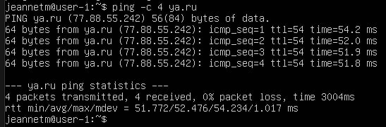
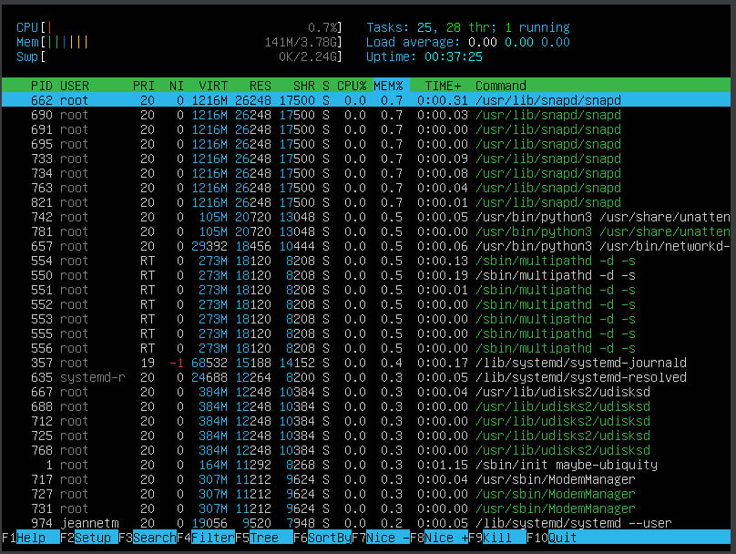
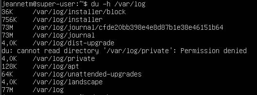

## Part 1. Установка ОС
1. Ubuntu 20.04 Server LTS без графического интерфейса (Используем программу для виртуализации - VirtualBox).
    ```sh
    cat /etc/issue

## Part 2. Создание пользователя
1. Вызов команды для создания пользователя и добавление пользователя в группу adm.
    ```sh
    sudo adduser newuser
    sudo usermod -aG adm newuser
    groups newuser


2. Вывод команды cat etc/passwd
    ```sh
    cat /etc/passwd

## Part 3. Настройка сети ОС
1. Задали название машины вида user-1. 
    ```sh
    sudo hostnamectl set-hostname user-1
    sudo nano /etc/hosts
    '127.0.1.1    user-1'


2. Установили временную зону НСК и проверили ее установку. 
    ```sh
    sudo timedatectl set-timezone Asia/Novosibirsk
    timedatectl


3. Вывод названия сетевых интерфейсов. **Интерфейс lo** — это петлевой интерфейс (loopback interface), который используется для связи программ на одном компьютере без выхода в сеть. **Интерфейс enp0s3** - то один из сетевых интерфейсов, который используется для соединения с сетью.
    ```sh
    ip link show


4. Получение ip адреса устройства от DHCP сервера. **DHCP** (Dynamic Host Configuration Protocol) — это сетевой протокол, используемый для автоматического присвоения IP-адресов и других сетевых параметров устройствам в сети. 
    ```sh
    ip a


5. Определение и вывод ip-адрес внешнего шлюза (ip).
    ```sh
    curl ifconfig.me


6. Определение и вывод внутреннего IP-адреса шлюза, он же ip-адрес по умолчанию (gw).
    ```sh
    ip route | grep default


7. Задали статичные (заданные вручную, а не полученные от DHCP сервера) настройки ip, gw, dns (использованы публичные DNS серверы, например 1.1.1.1 или 8.8.8.8). Проверены после перезагрузки. 
    ```sh
    sudo nano /etc/netplan/01-netcfg.yaml


    ```sh 
    'fill out the file'
    sudo netplan apply
    sudo reboot


    ```sh 
    ip a
    ip route
    systemd-resolve --status

 
 

    ```sh 
    ping -c 4 1.1.1.1

 

    ```sh 
    ping -c 4 ya.ru


## Part 4. Обновление ОС
    ```sh 
    sudo apt update
    sudo apt upgrade

## Part 5. Использование команды sudo
1. Для того чтобы дать пользователю newuser права на выполнение команд с помощью sudo, нужно добавить его в группу sudo + проверяем, что пользователь добавлен в группу. 
    ```sh 
    sudo usermod -aG sudo newuser
    groups newuser


2. **Команда sudo** (Super User DO) используется для выполнения команд от имени суперпользователя (root). Она позволяет временно повысить права доступа для выполнения задач, которые требуют административных прав, без необходимости постоянного использования учетной записи суперпользователя. 

3. Поменяй hostname ОС от имени пользователя newuser (используя sudo).

    ```sh 
    su - newuser


    ```sh 
    sudo hostnamectl set-hostname super-user


    ```sh 
    sudo nano /etc/hosts
    '127.0.1.1   super-user'


4. Проверяем изменение имени пользователя

    ```sh 
    hostname

## Part 6. Установка и настройка службы времени
1. Проверяем временную зону и статус службы синхронизации времени.
    ```sh
    sudo timedatectl set-timezone Asia/Novosibirsk
    timedatectl


    ```sh
    sudo systemctl status systemd-timesyncd


2.  Включение ее автоматического запуска при старте системы и проверяем наличие синхронизации.

    ```sh
    sudo systemctl start systemd-timesyncd
    sudo systemctl enable systemd-timesyncd


## Part 7. Установка и использование текстовых редакторов
1. Установка редакторов прошла успешно
    ```sh
    sudo apt install vim
    sudo apt install nano
    sudo apt install mc


2. Файл vim сохранен
-  Esc, чтобы выйти из режима вставки.
- :wq и Enter, чтобы сохранить изменения и выйти.


3. Файл nano сохранен
- Ctrl + O, чтобы сохранить файл.
- Ctrl + X, чтобы выйти.


4. Файл MCEDIT сохранен
- F2, чтобы сохранить файл.
- F10, чтобы выйти.


5. Файл vim не сохранен
-  :q! - закроет редактор VIM без сохранения изменений.


6. Файл nano не сохранен
- Ctrl + X для выхода.
- Когда будет предложено сохранить изменения - N.


7. Файл MCEDIT не сохранен
- F10 для выхода.
- Когда будет предложено сохранить изменения - Cancel/N.


8. Файл vim поиск (/слово)


9. Файл nano поиск (Ctrl + W)


10. Файл MCEDIT поиск (F7)


11. Файл vim замена (:%s/find word/new word/g
)


12. Файл nano замена (Ctrl + \\ + find word -> new word + Y)


13. Файл MCEDIT замена (F4 +  + find word -> new word + enter)


## Part 8. Установка и базовая настройка сервиса SSHD
1. Установка службы SSHd. (sudo apt install openssh-server)
    ```sh
    sudo apt install openssh-server


2. Добавление и включение автозапуска службы при загрузке системы

    ```sh
    sudo systemctl enable ssh
    sudo systemctl start ssh


3. Перенастройка службы SSHd на порт 2022. 

    ```sh
    sudo nano /etc/ssh/sshd_config
    'Port 2022'
    sudo systemctl restart ssh


4. Проверка наличия процесса sshd с помощью команды ps.

    ```sh
    ps -aux | grep sshd


5. Объяснение команды и каждого ключа (ps -aux | grep sshd)
- ps — команда, которая показывает список текущих процессов.
- -a — показывает все процессы, запущенные всеми пользователями.
- -u — отображает процессы в формате, который включает информацию о владельце процесса.
- -x — включает процессы, которые не привязаны к терминалу.
- | — перенаправление вывода одной команды на вход другой команды.
- grep — утилита для поиска строк, соответствующих шаблону.
- sshd — шаблон для поиска (имя процесса SSHd).
- result: Наличие процесса SSHd проверено с помощью команды ps -aux | grep sshd, что подтверждает его работу на указанном порту.

6.  Затем перезагрузили систему и ввели команду netstat -tan

    ```sh
    sudo reboot
    netstat -tan


**Ключи**
- -t: Показать только TCP-соединения (потоки данных).
- -a: Показать все активные соединения и порты, включая те, которые находятся в состоянии прослушивания (LISTEN).
- -n: Показать адреса и номера портов в числовом формате.

**Значение каждого столбца**
- Proto: Протокол соединения (tcp или tcp6 для TCP соединений по IPv4 и IPv6 соответственно).
- Recv-Q: Количество байтов данных, ожидающих приема (Receive Queue).
- Send-Q: Количество байтов данных, ожидающих отправки (Send Queue).
- Local Address: Локальный адрес и порт, на котором работает процесс.
- Foreign Address: Удаленный адрес и порт, с которым установлено соединение.
- State: Состояние соединения.

**Значение 0.0.0.0**
- 0.0.0.0 в столбце Local Address означает, что процесс прослушивает все сетевые интерфейсы на указанном порту. 0.0.0.0:2022 означает, что процесс прослушивает порт 2022 на всех интерфейсах, доступных на машине.
- 0.0.0.0 в столбце Foreign Address указывает на то, что соединение может быть установлено с любым удаленным адресом.

**Пример расшифровки**
Proto: tcp (используется протокол TCP).
Recv-Q: 0 (нет данных, ожидающих приема).
Send-Q: 0 (нет данных, ожидающих отправки).
Local Address: 0.0.0.0:2022 (процесс прослушивает порт 2022 на всех интерфейсах).
Foreign Address: 0.0.0.0:* (соединение может быть установлено с любым удаленным адресом).
State: LISTEN (процесс находится в состоянии прослушивания входящих соединений).

## Part 9. Установка и использование утилит top, htop
1. Установка и запуск top - список запущенных процессов и т.д. Обновляется в реальном времени.

    ```sh
    sudo apt install procps
    top


2. Установка и запуск htop - расширенная версия top с улучшенным интерфейсом

    ```sh
    sudo apt install htop
    htop


3.  Интерпретация вывода команды `top`:
- **uptime**: Время работы системы `up 8 min`.
- **Количество авторизованных пользователей**: `1 user`.
- **Общая загрузка системы**: Три значения средней загрузки за последние 1, 5 и 15 минут. `load average: 0.00, 0.06, 0.06`.
- **Общее количество процессов**: `95 total`.
- **Загрузка CPU**: `0.0 us` (пользовательское время), `0.0 sy` (системное время), `100.0 id` (время простоя).
- **Загрузка памяти**: `3872,2 total`, `3506,0 free`, `139,3 used`, `226,9 buff/cache`.
- **PID процесса, занимающего больше всего памяти**:  `PID 1 root`.
- **PID процесса, занимающего больше всего процессорного времени**: `PID 1 root`.

4. Отчет по 'htop':
- Отсортировано по PID (1), %CPU(2), %MEM(3), TIME(4)(F6 -> sort by):

PID (1)

 %CPU (2)

%MEM (3)

TIME (4)

- Отфильтровано для процесса sshd (F3):


- С процессом syslog, найденным с помощью поиска (F3):


- С добавленным выводом hostname, clock и uptime (F2 -> Display options -> schoose and enter):


## Part 10. Использование утилиты fdisk
1. Информация о жестком диске - Название 'Disk /dev/sda', размер '25 GiB', количество секторов '52428800', размер swap '11,51 GiB'

    ```sh
    sudo fdisk -l


 
## Part 11. Использование утилиты df
1. Команда df отображает информацию о дисках и разделах в системе, включая их размер, использованное и свободное пространство, а также процент использования.

    ```sh
    df -h /


**Объяснение вывода:**
- Filesystem: Название файловой системы. '/dev/mapper/ubuntu--vg-ubuntu--lv'
- Size: Общий размер раздела. '12G'
- Used: Занятое пространство. '4,9G'
- Avail: Свободное пространство. '5,8G'
- Use%: Процент использования. '46%'

2. Чтобы получить информацию о корневом разделе (/), включая его размер, занятое и свободное пространство, процент использования и тип файловой системы, используем команду df -Th:

    ```sh
    df -Th /


**Объяснение вывода:**
Filesystem: Название файловой системы или раздела. '/dev/mapper/ubuntu--vg-ubuntu--lv'
Type: Тип файловой системы (Extended File System 4). 'ext4'
Size: Общий размер раздела. '12G'
Used: Занятое пространство. '4,9G'
Avail: Свободное пространство. '5,8G'
Use%: Процент использования. '46%'

## Part 12. Использование утилиты du

0.**Для получения размера папок и их содержимого - du.**

1. Размер папок /home (du -h /home) '148K'


2. Размер папок /var (du -h /var) '762M'


3. Размер папок /var/log (du -h /var/log) '77M'



4. Размер содержимого каждого вложенного элемента в /var/log (du -h /var/log/*) '77M'


## Part 13. Установка и использование утилиты ncdu
0. 'ncdu' используется для быстрого анализа размеров папок

1. Установка 'ncdu' (sudo apt install ncdu)


2. Размер папок /home (ncdu /home) '148K'


3. Размер папок /var (ncdu /var) '762M'


4. Размер папок /var/log (ncdu /var/log) '77M'


## Part 14. Работа с системными журналами

1. Просмотр /var/log/dmesg 
    ```sh
   less /var/log/dmesg
2. Просмотр /var/log/syslog
    ```sh
   less /var/log/syslog
3. Просмотр /var/log/auth.log
    ```sh
   less /var/log/auth.log
4. Время последней успешной авторизации, имя пользователя и метод входа в систему.
    ```sh
   sudo grep 'Accepted' /var/log/auth.log | tail -n 1

- Время: Jun 30 22:16:32
- Имя пользователя: jeannetm
- Метод входа: (password)


5. Перезапуск службы SSHd

    ```sh
   sudo systemctl restart sshd

6. Сообщение о рестарте службы (в системных логах).

    ```sh
    sudo grep 'sshd' /var/log/auth.log | tail -n 20


## Part 15. Использование планировщика заданий CRON

1. Настройка crontab задания

    ```sh
    crontab -e
    '*/2 * * * * /usr/bin/uptime >> /var/log/uptime.log 2>&1'

 

2. Проверка выполнения задания в системных журналах

    ```sh
    grep 'uptime' /var/log/syslog

 

3. Просмотр текущих заданий crontab

    ```sh
    crontab -l

 